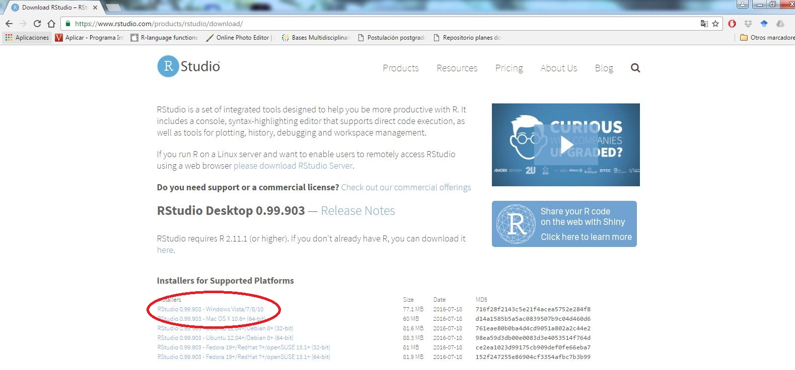
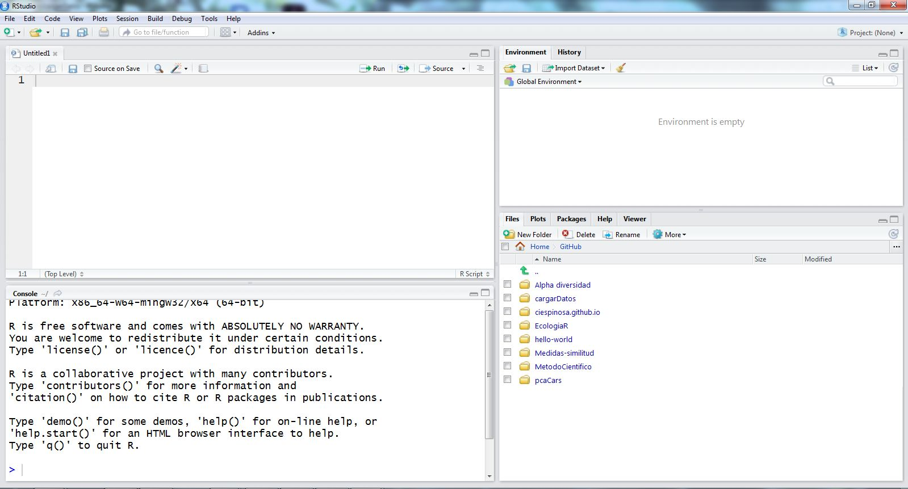
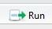
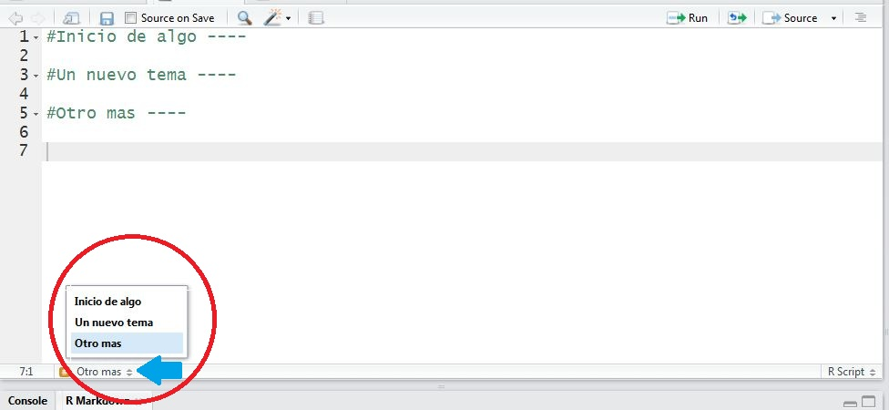

<br> </br>
Para regresar a Introducción R [
](https://ciespinosa.github.io/IntroduccionR)

****

Puedes descargar esta lección en pdf [aquí](https://ciespinosa.github.io/ConociendoR/index.pdf)

****

# Por qué usar R

__Open source (fuente abierta)__: __R__ es un lenguaje open source, <span class="fragment highlight-red"> __GRATUITO__ </span>

__Desarrolladores__: Tiene una cantidad enorme de desarrolladores, lo cual permite tener información y paquetes de cualquier tipo de análisis desde SIG hasta análisis de grafos.


__Orientado a gráficos y análisis estadísticos__: R es un lenguaje que permite desarrollar gráficos y análisis estadísticos. Tiene capacidad para desarrollar pre-procesamiento de datos.

__Lenguaje de programación__: El hecho de que R sea un lenguaje de programación en lugar de una colección de comandos discretos significa que puede combinar varios comandos, cada uno usando la salida del último, con la combinación resultante siendo bastante poderosa y extremadamente flexible.


# Instalando R y RStudio

-----

El primer paso será instalar  y  . Aunque existen muchas plataformas para trabajar con `R`, `RStudio` ofrece algunas ventajas que las analizaremos más adelante, por las que seleccionamos esta plataforma para trabajar. 

Para instalar `R` ingresa en la página web de [r-project](https://cran.r-project.org/bin/windows/base/). Una vez en esta página selecciona descargar (Figura 1).  Sigue los pasos para terminar la instalación.

<p> <br> </p>


<p> <br> </p>

La instalación de `RStudio` es similar a R, debe ingresar en la página de [RStudio](https://www.rstudio.com/products/rstudio/download/). Una vez en la página de descarga, seleccione la plataforma acorde a su sistema operativo (Figura 2) y siga los pasos para terminar la instalación.

<p> <br> </p>



<p> <br> </p>

Una vez que hemos instalado R y RStudio podremos trabajar con los datos. Una cosa importante es que RStudio no puede funcionar si no hemos descargado R, así que se debe asegurar descargar los dos programas. Trabajaremos en RStudio así que no es necesario que despliegue R.

>Nota: "El uso de comandos exige una curva de aprendizaje mayor que el requerido por las interfaces gráficas, pero las ganancias en términos de independencia, creatividad y control no son comparables. Escribir un código supone una comprensión más profunda de aquello que se desea aplicar" (Elousa 2011).

****

#Conozcamos RStudio antes de empezar



<p> <br> </p>

Como vemos en la figura 4, RStudio está compuesto por cuatro ventanas.  Seguramente en su caso, si acaba de abrir RStudio le aparecerán únicamente tres ventanas. A continuación, describiré cada una de las ventanas.

La __primera ventana__ (la que en su caso seguramente no tiene, izquierda superior) lo constituye documentos que pueden ser de varios tipos. El tipo básico es un documento con extensión __.R__, el cual sirve para guardar el código desarrollado para el análisis.  Vamos abrir un documento .R (script), esto lo podemos hacer de al menos tres maneras, la primera es ir al menú de la consola seleccionar `File > New File > script`, la segunda forma es seleccionar el icono del documento con una cruz verde  y seleccionar `R script`.  La última opción es hacerlo desde el teclado, presione `alt + shift` (mayúsculas) y la tecla __N__ obtendrá el mismo resultado.

Existen otros muchos archivos que podemos cargar, pero por ahora veremos solo este.

La __segunda ventana__ (derecha superior), esta ventana se verán todos los objetos que iremos cargando o generando durante el trabajo en RStudio, por ahora esta ventana estará vacía. Esta ventana nos muestra la memoria activa de R, lo que en un computador se conoce como la memoria RAM.

>Vamos a generar algunos objetos y ver lo que pasa.

```{r}
nombre<- "Carlos Ivan"
apellido<- "Espinosa Iñiguez"
matriz<- matrix(1:20, 5,4)

```

Ahora podemos ver los objetos creados, algunos salen como valores y la matriz sale como datos.  Los objetos pueden ser abiertos para ver su estructura. Si hacen clic en el nombre matriz verán que se abre una nueva hoja en la primera ventana que corresponde a estos datos.

La __tercera ventana__ (izquierda abajo), corresponde a la consola de R, esta es la consola donde se ejecutarán todos los códigos y se realizarán los análisis. Esta ventana es R. RStudio incorpora a R dentro de su ejecución, por lo que si no hemos instalado R esta ventana no aparecerá. 

La __cuarta ventana__ (derecha abajo), en esta ventana tenemos varias pestañas.  La primera `File` nos muestra todos los archivos que están en la carpeta de mi proyecto, guardados en el disco duro. Pueden ser archivos de datos, gráficos generados o el script de R que estoy generando. La siguiente pestaña `Plots` mostrará los gráficos que va ejecutando en R. La pestaña `Help` puede ser usada para pedir ayuda de algún paquete o función que necesite usar, y no esté claro de cómo hacerlo.

Bueno ya conocemos RStudio ahora si a trabajar. 


>Nota: El trabajar con códigos requiere que seamos ordenados y sistemáticos, de no cumplir estos requerimientos tendrá un verdadero dolor de cabeza. RStudio es una interesante plataforma que nos permite organizar el trabajo. Siempre que inician un trabajo de análisis siga los pasos propuestos a continuación.

****

# Los primeros pasos
El trabajo de programación requiere ser ordenados, considero que trabajar con RStudio nos ofrece algunas ventajas para organizar ese trabajo.

## Primer Paso: Crear un proyecto

Crear un proyecto implica definir un directorio desde el cual `R` funcionará. Este proceso creará una carpeta a la cual R estará anclado. Además, en esta carpetaencontrará un archivo .Rproj desde el cual podrá abrir RStudio.

Para crear un nuevo proyecto en RStudio debemos seguir los siguientes pasos.

1. Abrir RStudio
2. Hacer clic en `file` y seleccionar new `Project`
3. En la nueva ventana que se abrió, podemos seleccionar entre tres opciones, puesto que aún no estamos trabajando con versiones de control, por ahora podemos seleccionar entre nuevo directorio `New Directory` o un directorio existente `Existing Directory`.

Si seleccionamos `New Directory`(nuevo directorio) se generará una nueva carpeta en la ubicación que nosotros definamos, en esta carpeta podremos poner todos los datos y demás información con la cual trabajaremos. Cuando seleccionamos `Existing Directory` (un directorio existente) RStudio generará un proyecto dentro de una carpeta que ya exista en el computador.  Por organización, siempre que estoy iniciando un nuevo proyecto prefiero crear un nuevo directorio en el cual colocaré únicamente los archivos que voy a utilizar en los análisis.

4. Si hemos elegido `New Directory` tendremos dos casilleros, el primero indica el nombre que le vamos a poner a la carpeta `Directory Name` y el segundo nos indica donde alojaremos esa carpeta `browse`.

5. Si hemos elegido `Existing Directory`, la siguiente ventana nos permite decir cuál es la carpeta que quiero enlazar. Hacer clic en `browse`  buscar la carpeta donde colocaré el proyecto y aceptar.


##Segundo Paso: Los códigos usados

Si bien podemos trabajar directamente en la consola de R para  ejecutar los códigos, lo mejor es que desde el principio nos acostumbremos a generar scripts, donde tengamos la información limpia y podamos saber lo que estamos haciendo. Un Script es un archivo donde tendremos los códigos de R, referenciados y organizados.

__Algunos consejos iniciales__

a. Todos los códigos usados para realizar los diferentes análisis, deben siempre deben ir acompañados de una nota que explique lo que están haciendo. La nota debe estar precedida por __#__, con lo cual R no lee esta parte como código (Figura 4). 
b. Recuerden siempre colocar sus archivos de datos en la carpeta del proyecto que generaron en el primer paso.
c. Si está probando cambios en el código, una vez que tiene un código que funciona, borre el código con error o que no le funcionó, <mark>tenga siempre su código limpio</mark>.

d. Una vez que escribe el código, este puede ser ejecutado desde la consola haciendo clic en la consola en el ícono run  que se encuentra en la parte superior derecha de la ventana del script.  Sin embargo, una mejor forma es tecleando __ctrl__ y __enter__.
e. Cada vez que en el código iniciamos un nuevo tema, podemos poner un título seguido por cuatro guiones medios (- - - -), esto genera en RStudio una estructura de índice que puede ser navegada (Figura 5 círculo rojo abajo a la izquierda).





<p> <br> </p>

>Nota: Es importante que sea organizado en la ejecución de los códigos, siga los consejos y podrá mantener un código limpio y fácil de acceder y revisar.

****

# El funcionamiento de R

Hemos hablado mucho de `R` pero hasta ahora no hemos dicho que es, ¿es un programa?, no, realmente no es un programa, es un entorno de programación. R es considerado un dialecto del lenguaje _S_ el cual fue desarrollado por los Laboratorios AT&T Bell.  

Aunque mucha gente se asusta cuando hablamos de R, como un lenguaje de programación, la realidad es que R es un lenguaje bastante simple, está orientado a _Objetos_. Por otro lado, a diferencia de otros lenguajes de programación los comandos escritos en el teclado, son ejecutados directamente sin necesidad de construir ejecutables.

En R tenemos al menos tres grandes categorías de objetos; funciones, datos y resultados.  Cada una de estas tiene unas características propias.  Las _funciones_ normalmente se encuentran dentro de paquetes, estos objetos traen comandos que permiten manipular los datos. Accedemos a las funciones a través de comandos. Los _datos_ son matrices o vectores de información los cuales son manipulados por las funciones. Los _resultados_ son objetos resultantes de la manipulación de los datos (Figura 3).

```{r, echo=FALSE, fig.align='center', fig.cap="Figura 3. Esquema del funcionamiento de r. Basado en Paradis 2003", fig.height=4, fig.width=7}

x <- 1:100
y <- 1:100 

par(mar=c(1,5,1,5))
plot(x, y, type="n", ann=FALSE,axes=FALSE, col="grey") 
box(col="grey")
rect(min(x), min(y)+2, max(x)-55, max(y))
rect(min(x)+55, min(y)+2, max(x), max(y))

rect(min(x)+5, min(y)+5, max(x)-60, max(y)-85, lty="dashed")
rect(min(x)+5, min(y)+40, max(x)-60, max(y)-40, lty="dashed")
rect(min(x)+5, min(y)+85, max(x)-60, max(y)-5, lty="dashed")

text(12,10, "Resultados", adj=0)
text(17,50, "Datos", adj=0)
text(12,92, "Funciones", adj=0)

text(62,17.5, "Archivos de salida", adj=0, cex=0.9)
rect(min(x)+60, min(y)+5, max(x)-25, max(y)-85,  col="blue")
rect(min(x)+80, min(y)+5, max(x)-5, max(y)-85,  col="blue")
text(63, 11, "JPG", col="white", font=2, adj=0, cex=0.8)
text(83, 11, "XLSX", col="white", font=2, adj=0, cex=0.8)

text(63, 50, "Datos y archivos", col="black", adj=0, cex=0.9)
text(63, 92, "Librería de 
funciones", col="black", adj=0, cex=0.9)

mtext("Internet", side=3, line =-2.5,col="black", font=3, at=120, cex=0.9)
mtext("Comandos", side=3, line =-2.5,col="black", font=3, at=-15, cex=0.9)
mtext("Pantalla", side=3, line =-8,col="black", font=3, at=-15, cex=0.9)

mtext("Memoria Activa", side=1, line =-1,col="black", font=4, at=20, cex=0.9)
mtext("Disco Duro", side=1, line =-1,col="black", font=4, at=80, cex=0.9)

par(new=TRUE)
par(mar=c(1,1,1,1))
plot(x, y, type="n", ann=FALSE,axes=FALSE, col="grey") 
arrows(93, 91, 75, 91, length=0.08,angle=30,lwd=2)
arrows(93, 91, 45, 50, length=0.08,angle=30,lwd=2)

arrows(58, 91, 45, 91, length=0.08,angle=30,lwd=2)
arrows(58, 50, 45, 49, length=0.08,angle=30,lwd=2)

arrows(9, 91, 18, 91, length=0.08,angle=30,lwd=2)
arrows(8, 52, 18, 50, code=1, length=0.08,angle=30,lwd=2)
arrows(37, 48, 60, 20, length=0.08,angle=30,lwd=2)

```

El funcionamiento de R se da en la memoria activa, así que cada vez que iniciamos a trabajar con R es necesario llamar los datos desde el disco duro a la memoria activa.  Para llamar paquetes (donde tenemos las funciones) normalmente utilizamos la función `library`, mientras que para llamar los datos utilizamos funciones como `read.table`. Algunas veces nos interesa grabar un resultado desde la memoria activa al disco duro para esto podemos utilizar funciones como `write.table`. 
Finalmente, no todos los paquetes disponibles se bajan cuando instalamos R, de hecho, solo se baja un paquete conocido como paquete base. Cuando se necesita un nuevo paquete, este debe llamarse desde internet, para ello utilizamos la función `install.packages`. Existe un repositorio de todos los paquetes disponibles (Comprehensive R Archive Network, __CRAN__) y varios países tienen espejos de estos repositorios (espejos CRAN) a partir de los cuales podemos descargar los paquetes.

>Nota: Es muy importante que antes de empezar a trabajar con R seamos conscientes de cómo funciona, esto facilitará entender lo que está haciendo cuando introduce un código.

****

## Uso de la memoria activa

Vamos a trabajar en R

1. Abra RStudio y cree un proyecto 
2. Genere un Script para escribir el código.
3. Ahora a trabajar

****

### Ejecución de comandos e impresión

Cuando estamos trabajando con R, nosotros podemos desarrollar una serie de acciones u operaciones que se ejecutan en la consola, luego de lo cual el resultado puede ser impreso en la consola. Veamos unos ejemplos.

```{r}
#Ejecución de comandos e impresión

pi*3

log(234)

```

Cuando nosotros introducimos el comando en R y lo ejecutamos, podemos ver la salida de esa expresión, R imprime el resultado directamente en la consola. Podemos usar la función `print()` para pedir a R que imprima el resultado.

```{r}
##La función de impresión

print(pi*3); print(pi*3, digits = 4) #El ; nos permite separar dos líneas de código

print(log(234), digits = 10)
```

Como vemos con el uso de la función `print()` tenemos la misma salida, imprime el resultado en la consola. Sin embargo, nos permite cambiar ciertas propiedades de lo que se imprime, en este caso controlar el número de decimales. Cuando trabajamos con tablas, la función print nos permite controlar la salida de esas tablas.


```{r}
##Controlar la salida de tablas

print(as.table(matrix(c(5:0,1,0,0),3,3)))
print(as.table(matrix(c(5:0,1,0,0),3,3)), zero.print = ".")
```

En este caso el argumento _zero.print_ nos permite decirle que queremos substituir los ceros por un punto podemos cambiar el punto por un "-". Inténtalo y mira lo que obtienes.

Aunque la función print nos permite tener cierto control sobre lo que imprimimos en la consola, esta función solo puede ser aplicada a una expresión a la vez. Cuando queremos que se imprima una expresión compuesta por varias expresiones, podemos usar la función `cat()`

```{r}
##La función cat para imprimir vectores

cat("Juan tiene", round(17*pi, 2), "años\n", 
    "Juan es adulto mayor")

```

La función __cat__ permite imprimir varias cosas juntas, intente usar la expresión print para ejecutar el mismo vector. ¿Qué sucedió?. El argumento final __"\n"__ nos dice que hay un salto de línea.  


Hasta aquí, todos los códigos que hemos ejecutado se han impreso en la consola pero no constan en ningún lado, todos los resultados de esos códigos no pueden ser usados para realizar ninguna otra acción. Hemos usado R como una calculadora, la cual nos da un resultado, pero no podemos volver a acceder a ese resultado de ninguna forma.

Para acceder a los resultados necesitamos asignar el resultado a un símbolo, un nombre.

### Asignación y generación de objetos

El trabajo que hicimos en la sección anterior no generó objetos, como había comentado los objetos son las estructuras sobra las cuales R opera. Podemos generar objetos usando la función `<-`. Existen otras formas de asignar, como "=", o "->", sin embargo, es mejor no usarlas puesto que por ejemplo el "=" puede ser confundida con la expresión _igual que_. En el caso de la función "->" si bien cuando generamos un objeto sencillo puede usarse, cuando estamos generando una expresión más compleja es muy difícil entender si al final está la asignación. Por estas razones es mejor que siempre use "<-".


__Trabajemos nuevamente en R__

```{r}
##Asignando resultados a símbolos
set.seed(23)
edad <- round(rnorm(5, 25,40),2)

```


*__Un momento, algo paso, no veo el resultado.__* 

Puede chequear el "Environment" en RStudio, ¿qué puede ver ahí?. Efectivamente, aparece el nombre edad. Hemos generado un objeto que está representado por el símbolo _edad_

Usar la función asignar "<-", y hemos asignado el resultado de nuestro código a un símbolo (nombre). R reconoce este nombre como un símbolo, es por eso que __Edad__ no es lo mismo que __edad__.

Ahora, ¿cómo podemos imprimir el resultado de edad?.
Ejecutando las mismas funciones de imprimir (print y cat) que usamos antes  o teclear directamente el nombre.


```{r}
#Imprimir los objetos
print(edad)

edad
```

Vamos a jugar un poco. Usaremos la `función cat()` para imprimir un objeto que tiene varios elementos, imprimiremos cada uno de los elementos que están asociados. En este caso tenemos un nombre de una persona y la edad de esas personas. Para esto usamos una función que genera un loop (un proceso circular un bucle), en este caso la función `for()`. Esta función permite definir un símbolo en este caso "i" y darle un valor secuencial definido por el usuario. En el caso del ejemplo i tomará los valores de 1 a 5 (número de elementos en nom), de esta forma R generará un ciclo (bucle) en el cual _i_ toma el valor de _1_, en la siguiente vuelta _2_ y así sucesivamente hasta 5.

```{r}
#Vector de nombres

nom <- c("Juan", "Pedro", "Ana", "Sol", "Juliana")

#Usamos la función cat para imprimir

for(i in 1:length(nom)) cat("La edad de", nom[i], "es", edad[i], "\n")

```

Pero, no sabemos que categoría tiene. Podemos incluir la categoría de joven, adulto o adulto mayor. Usaremos la función ´if()´ para pedirle a R que nos diga que categoría tiene cada uno.

```{r}
#Vector de nombres

nom <- c("Juan", "Pedro", "Ana", "Sol", "Juliana")

#Usamos la función cat para imprimir

for(i in 1:length(nom)) cat("La edad de", nom[i], "es", edad[i], "\n",
                            nom[i], "es un", ifelse(edad[i]<20, "joven", 
                                               ifelse(edad[i]>50, "adulto mayor", "adulto")), "\n")

```
En esta segunda parte hemos trabajado en la memoria activa de la computadora, la memoria RAM. Cuando asignamos una variable a un símbolo, como en este caso "edad", la variable se mantiene en su espacio de trabajo (Workspace). El espacio de trabajo se mantiene en la memoria activa de la computadora, pero se puede guardar en el disco cuando R se cierra. La variable permanece en el espacio de trabajo hasta que el usuario la elimine. Aunque, RStudio permite ver el workspace, podemos pedirle a R que nos muestre lo que tiene en su "workspace" usando la función `ls()`.


```{r}
#Listado del workspace
ls()

```

Podemos pedir que nos diga las características de esos objetos

```{r}
#listado con características

ls.str()
```


### Eliminando objetos

Puede ser que necesite borrar algunos objetos que ya no ocuparé, para ello usaremos la función `rm()`.  Veamos cómo lo podemos hacer.

```{r}
ls(); rm(i); ls()
```

Como ven en la primera salida de nuestro workspce consta "i", pero la segunda vez que ejecutamos ls el objeto "i" ya no aparece.

Podemos usar la expresión rm(list=ls()) para borrar todos los objetos en el workspace o usar la expresión rm(list=setdiff(ls(), c("edad", "nom"))), para eliminar todo aquello que no sea "edad" ni "nom"

****


## Uso del disco duro

Hasta ahora hemos trabajado en la memoria activa, eso quiere decir, que cuando cerremos R todos los objetos que hemos desarrollado se pierden. Es posible que eso sea lo que quiero, pero seguramente hay resultados que me gustaría grabar en mi disco duro para poder acceder a ellos.

A diferencia de programas tradicionales, para grabar los datos necesito usar una función y no un menu de ventanas.


### Guardando datos

Podemos usar la función __sink__ para redireccionar la salida a un archivo .txt, de esta forma, R ya no imprimirá en la consola sino que lo hará en el documento que hemos generado. Debemos volver a correr la función __sink__ para que se cierre la conexión con el archivo. 

__Recuerden:__ siempre deben cerrar esta función caso contrario todo lo que hagan se imprimirá en este archivo.

```{r ,eval=FALSE}
sink("names_output.txt")
for(i in 1:length(nom)) cat("La edad de", nom[i], "es", edad[i], "...\n")
sink()
```

Podríamos generar un reporte con los datos utilizando la función __sink__. De esta forma, procesaremos los datos de edad y género que tenemos y los imprimiremos en un __.txt__ llamado reporte1.


```{r}
dta <- data.frame(edad, nom, gen=c(rep("Hombres",2), rep("Mujeres",3)))
resul <- tapply(dta$edad, dta$gen, mean)
```


```{r,eval=FALSE}
sink("reporte1.txt")

print(resul)

summary(dta)
cat("Conclusión: La mayor media de edad se presenta en",
    names(resul[resul==max(resul)]),"(", max(resul), ")", 
     ", mientras que la menor edad en", 
    names(resul[resul==min(resul)]),"(", min(resul), ")")
sink()
```

Aunque la función __sink__, puede ser util para guardar rápidamente resultados, por ejemplo resultados de análisis estadísticos, no es una buena opción para guardar tablas de datos. Para guardar  tablas es mejor usar la función __write.csv__. 

Veamos un ejemplo.

```{r}
write.csv(dta, file="datosEdad.csv", row.names=FALSE)
```

Ahora podemos ver los archivos que se han generado usando la función __dir__

```{r}
dir()
```


### Leyendo los datos

Como hemos visto hasta ahora, R trabaja con unos datos los puede procesar y modificar, todo esto usando la memoria activa (workspace), sin embargo, esa memoria es temporal, si queremos que algo de lo procesado se mantenga como un archivo en mi disco duro, necesito decirle a R que lo guarde.

La información en el disco duro puede ser llamada al workspace de R, pero nuevamente, a diferencia de cualquier otro programa, este paso lo debemos hacer usando una función.

Vamos a volver a leer los datos que habíamos generado en R y guardado en el disco duro. Tenemos dos tipos de archivos un *.txt* y un *.csv*, para cada uno de ellos puedo usar una función. Veamos como hacerlo.

```{r}
dta2 <- read.csv("datosEdad.csv", header=T)
edad2 <- read.table("names_output.txt")

dta2; edad2
```

### Leyendo desde una url

Una ventaja de R es que podemos cargar los datos desde cualquier fuente, por ejemplo desde una página web. Vamos usar unos datos subidos en la página:
[datos](https://github.com/Ciespinosa/datos_practicas/blob/master/AMEBIASIS_LOJA.csv)

```{r}
url <- "https://raw.githubusercontent.com/Ciespinosa/datos_practicas/master/AMEBIASIS_LOJA.csv"

dtaAm <- read.csv2(url, header = TRUE, sep = ",")

head(dtaAm, 5)
```


__¿En dónde están los datos?__

Se encuentra en la memoria activa. Si apago R los datos se perderán, debo guardarlos en el disco duro. Prueben grabar los datos en el disco duro.

Hasta ahora hemos trabajado en la __consola__, cuando usábamos R como una calculadora, usando la __memoria activa__, asignando a un símbolo (nombre) unos datos, y finalmente, el disco duro cuando leemos o grabamos unos datos en el disco duro.

Aunque si lo pensamos bien, hemos usado también el __internet__ cuando leímos datos de la red.

## Uso de la Web

R puede usar el __internet__ para; i) descargar datos, ii) subir datos y iii) descargar paquetes. Hay muchas otras aplicaciones para descargar datos de la web, además, podemos usar R para subir datos a bases de datos o sencillamente hacer una página web. Por ahora quiero que sepan que es posible hacerlo, aunque esto sería otro curso.


### Los paquetes y su instalación

Los paquetes es la forma que tiene R para organizar las funciones usadas para desarrollar diferentes acciones. Así, muchas funcione de estadística básica como; la media la desviación estándar, entre otras se encuentran dentro de un paquete que se denomina paquete base. 

Cuando instalamos R, algunos paquetes son instalados por defecto, pero R tiene miles de paquetes, si necesitamos trabajar con un paquete más específico debemos instalarlo.

#### Instalando paquetes

Nuevamente, recuerde R no funciona con pestañas, por lo que instalar un paquete se lo debe hacer usando código. En este caso se usa la función `install.packages()`

```{r}
#install.packages("xlsx")

```

La función __install.packages()__ nos permite descargar del internet los paquetes y grabarlos en nuestro disco duro. El paquete __xlsx__ tiene varias funciones para leer, editar y escribir archivos .xlsx.

Para llevar el paquete del disco duro a nuestra consola, que es donde lo usaremos, es necesario usar una nueva función, en este caso la función `library(xlsx)`.

La instalación de los paquetes se debe hacer únicamente una vez, cuando hemos descargado el paquete, este está disponible en nuestro disco duro, así que podemos llamarlo desde ahí cada vez que lo necesitemos. 


# Ejercicio

Espero que lo que hemos visto hasta ahora nos haya permitido tener una idea clara de cómo funciona R.

Para desarrollar la tarea siga los siguientes pasos:

- Cree un proyecto con nombre Tarea1.
- Genere un script donde pondrá todos los códigos usados en la tarea 1.
- Leer el archivo leyendoDatos.txt en la página: https://raw.githubusercontent.com/Ciespinosa/datos_practicas/master/leyendoDatos.txt
- Para leer este archivo use la función readLines() incluya en esta la url de donde quiere obtener la información. Puede usar la función de ayuda para saber como usar esta función.
- Use la función sink e imprimir para grabar la tarea en su disco duro.
- El archivo contiene información para desarrollar la tarea.

